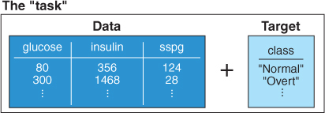
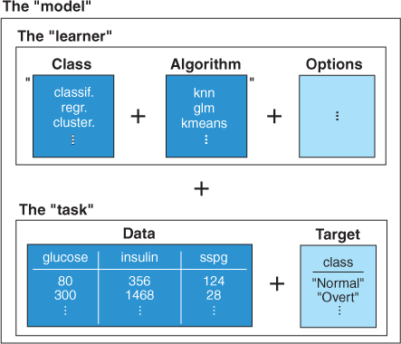
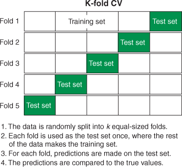

This notebook shows how to uild a kNN classifier that we can use to predict diabetes status from measurements of future patients. It is based on chapter 3 of [_Machine Learning with R, the tidyverse, and mlr_](https://www.manning.com/books/machine-learning-with-r-the-tidyverse-and-mlr) by Hefin Rhys (2020). 


Building a machine learning model has three main stages:

* Define the task. The task consists of the data and what we want to do with it. In this case, the data is contained in a tibble: `diabetesTib`, and we want to classify the data with the class variable as the target variable.
* Define the learner. The learner is simply the name of the algorithm we plan to use, along with any additional arguments the algorithm accepts. We're going to be using the k-Nearest Neighbour (kNN) learning algorithm.
* Train the model. This stage is what it sounds like: you pass the task to the learner, and the learner generates a model that you can use to make future predictions.         

First off we'll load in the diabetes data from the `mclust` package and create a tibble to store the data, we'll also draw some summary graphs to understand the data. Remember we're going to find a set of feature variables that we can use to train the model so that we can predict a target variable. Specifically for this dataset we're looking at insulin, glucose and sspg variables as predictors of the class of diabetes a given patient may have. It could equally be survival chances for passengers on the Titanic, varieties of iris, etc.

```{r}
library(mlr)
library(tidyverse)

data(diabetes, package = "mclust")
diabetesTib <- as_tibble(diabetes)

summary(diabetesTib)
```


```{r}
ggplot(diabetesTib, 
       aes(glucose, insulin, shape = class, color = class)) +
  geom_point() + 
  theme_bw()

ggplot(diabetesTib, 
       aes(sspg, insulin, shape = class, color = class)) +  
  geom_point() +  
  theme_bw()

ggplot(diabetesTib, 
       aes(sspg, glucose, shape = class, color = class)) +  
  geom_point() +
  theme_bw()
```

Now we can create the classification task for this. A task is an mlr contsruct that contains the data with the predictor variables, and the target variable we want to predict. In this case the predictor variables are the insulin, glucose and sspg variables, and we want to target the class of diabetes (Normal, Chemical or Overt).



Create a new task with the `makeClassifTask` function:

```{r createTask}
diabetesTask <- makeClassifTask(data = diabetesTib, 
                                target = "class")
```

```{r}
diabetesTask
```

We're going to train a K-nearest neighbour classifier, so we setup a learner to do this, setting the value of `k` (which is termed a 'hyperparameter') to 2:

```{r createLearner}
knnLearner <- makeLearner("classif.knn", par.vals = list("k" = 2))
knnModel <- train(knnLearner, diabetesTask)
```

Training a learner means fitting a model to a given data set. Subsequently, we want to predict the label for new observations. As you can see from the above, we've trained our model using kNN:

```{r}
knnModel
```

Think of the model as the combination of the task and learner:



Subsequently, we want to predict the label for new observations, and evaluate the performance of the model. 

```{r}
knnPred <- predict(knnModel, newdata = diabetesTib)

performance(knnPred, measures = list(mmce, acc))
```

## Cross-Validation

In order to understand how good our model is, whether it is underfitting or overfitting the data, we need to perform some cross-validation. We'll use k-fold cross-validation here, setting the number of folds to 10.

Cross-validation is a way of evaluate the performance of your model on data it hasn’t seen yet by repeatedly sifting the data that is used for the training and test sets.

```{r include=FALSE}
kFold <- makeResampleDesc(method = "RepCV", 
                          folds = 10, reps = 50, 
                          stratify = TRUE)
kFoldCV <- resample(learner = knnLearner, task = diabetesTask, 
                    resampling = kFold, measures = list(mmce, acc))
```

```{r}
print(kFoldCV$aggr)
```
The following diagram shows how the folding works:


Finally, lets look at the confusion matrix for one of the resamplings, and see how this compares with the one we generated previously:

```{r}
calculateConfusionMatrix(kFoldCV$pred, relative = TRUE)
```

## Hyperparameter Tuning

With the kNN learner, there is a single hyperparameter that we have to decide on: _k_. But what value of _k_ is best to use? This is where hyperparameter tuning comes in. We can define a range of values for _k_ which can then be run as a parameter sweep.

```{r}
knnParamSpace <- makeParamSet(makeDiscreteParam("k", values = 1:12))
```

The `makeParamSet()` function defines the hyperparameter space we'll be using. In this example the space just contains a single hyperparameter: _k_. Next we setup a grid search method to run the parameter sweep. This simply tries every single value in the parameter space when looking for the best-performing value.

```{r}
gridSearch <- makeTuneControlGrid()
```

The principle with running the parameter sweep is that for every value in the parameter space (integers 1 to 12), we perform repeated k-fold CV. For each value of _k_, we take the average performance measure across all those iterations and compare it with the average performance measures for all the other values of _k_ we tried. In this way we find the 'best' _k_. We call the `tuneParams()` function to perform the tuning. We'll reuse the k-fold resampling we used previously. This will take some time as it repeatedly iterates through the 'grid' of k-values from 1-12, running k-fold resamplings for each.

```{r include=FALSE}
tunedK <- tuneParams("classif.knn", task = diabetesTask,
                     resampling = kFold,
                     par.set = knnParamSpace, control = gridSearch)
```

We can see that the best value is k=7 (along with its average MMCE value of 0.076):

```{r}
tunedK
```

We can nicely visualise the tuning process like this:

```{r}
knnTuningData <- generateHyperParsEffectData(tunedK)
plotHyperParsEffect(knnTuningData, 
                    x = "k", y = "mmce.test.mean",
                    plot.type = "line")
```
Now we are ready to train our final model, using a _k_ of 7 (rather than the $k=2$ we chose originally):

```{r}
tunedKnn <- setHyperPars(makeLearner("classif.knn"), par.vals = tunedK$x)
tunedKnnModel <- train(tunedKnn, diabetesTask)
```

Once we have our final model we can see how it will classify new patients. For example, say we have a set of new patients:

```{r}
newDiabetesPatients <- tibble(glucose = c(82, 108, 300),
                              insulin = c(361, 288, 1052),
                              sspg = c(200, 186, 135))

newDiabetesPatients
```

Let's pass this data set into our model to get their predicted diabetes status:

```{r}
newPatientsPred <- predict(tunedKnnModel, newdata = newDiabetesPatients)
print(newPatientsPred)

getPredictionResponse(newPatientsPred)
```

```{r}
sessionInfo()
```

