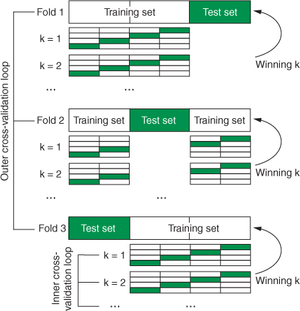

This notebook shows how to uild a kNN classifier that we can use to predict diabetes status from measurements of future patients. It is based on chapter 3 of [_Machine Learning with R, the tidyverse, and mlr_](https://www.manning.com/books/machine-learning-with-r-the-tidyverse-and-mlr) by Hefin Rhys (2020). Note however that we'll use the updated `mlr3` package rather than `mlr` as in the book.


Building a machine learning model has three main stages:

* Define the task. The task consists of the data and what we want to do with it. In this case, the data is contained in a tibble: `diabetesTib`, and we want to classify the data with the class variable as the target variable.
* Define the learner. The learner is simply the name of the algorithm we plan to use, along with any additional arguments the algorithm accepts. We're going to be using the k-Nearest Neighbour (kNN) learning algorithm.
* Train the model. This stage is what it sounds like: you pass the task to the learner, and the learner generates a model that you can use to make future predictions.         

First off we'll load in the diabetes data from the `mclust` package and create a tibble to store the data, we'll also draw some summary graphs to understand the data. Remember we're going to find a set of feature variables that we can use to train the model so that we can predict a target variable. Specifically for this dataset we're looking at insulin, glucose and sspg variables as predictors of the class of diabetes a given patient may have. It could equally be survival chances for passengers on the Titanic, varieties of iris, etc.

```{r}
library(mlr3)
library(mlr3learners)
library(tidyverse)

data(diabetes, package = "mclust")
diabetesTib <- as_tibble(diabetes)

summary(diabetesTib)
```


```{r}
ggplot(diabetesTib, 
       aes(glucose, insulin, shape = class, color = class)) +
  geom_point() + 
  theme_bw()

ggplot(diabetesTib, 
       aes(sspg, insulin, shape = class, color = class)) +  
  geom_point() +  
  theme_bw()

ggplot(diabetesTib, 
       aes(sspg, glucose, shape = class, color = class)) +  
  geom_point() +
  theme_bw()
```

Now we can create the classification task for this. A task is an mlr contsruct that contains the data with the predictor variables, and the target variable we want to predict. In this case the predictor variables are the insulin, glucose and sspg variables, and we want to target the class of diabetes (Normal, Chemical or Overt).


Create a new `TaskClassif` using the `$new` constructor method to do this:

```{r}
diabetesTask = TaskClassif$new(id = "diabetesTib", 
                               backend = diabetesTib, 
                               target = "class")
```

Note that the syntax for `mlr3` is slightly different from the older `mlr` package, where the equivalent would be to use the `makeClassifTask` function:

```{r eval=FALSE, include=TRUE}
diabetesTask <- makeClassifTask(data = diabetesTib, 
                                target = "class")
```

```{r}
diabetesTask
```
We're going to train a K-nearest neighbour classifier, so we setup a learner to do this, setting the value of `k` (which is termed a 'hyperparameter') to 2:

```{r}
knnLearner <- lrn("classif.kknn", id = "knn", k = 2)
knnLearner$train(diabetesTask)
```

Again the syntax for `mlr3` is slightly different from the older `mlr` package, where the equivalent would be to use the `makeClassifTask` function:

```{r eval=FALSE, include=TRUE}
knnLearner <- makeLearner("classif.knn", par.vals = list("k" = 2))
knnModel <- train(knnLearner, diabetesTask)
```

Training a learner means fitting a model to a given data set. Subsequently, we want to predict the label for new observations. As you can see from the above, we've trained our model using kNN:

```{r}
knnLearner$model
```

Think of the model as the combination of the task and learner:


Subsequently, we want to predict the label for new observations. These predictions are compared to the ground truth values in order to assess the predictive performance of the model. It is common split our data in to training and testing sets, and to train on a majority of the data. Here we use 80% of all available observations and predict on the remaining 20%. For this purpose, we create two index vectors:

```{r}
train_set = sample(diabetesTask$nrow, 0.8 * diabetesTask$nrow)
test_set = setdiff(seq_len(diabetesTask$nrow), train_set)
```

Now lets retrain based on this split (using `row_ids` to perform the split), and output the confusion matrix:

```{r}
knnModel <- knnLearner$train(diabetesTask, row_ids = train_set)
prediction = knnLearner$predict(diabetesTask, row_ids = test_set)

print(prediction$confusion)
```

Now lets check the accuracy of the model based on these predictions. For this we'll use the classifier accuracy `classif.acc` measure.

```{r}
measure = msr("classif.acc")
prediction$score(measure)
```

## Cross-Validation

In order to understand how good our model is, whether it is underfitting or overfitting the data, we need to perform some cross-validation. We setup a resampling object and resample. We'll use k-fold cross-validation here, setting the number of folds to 10.

Cross-validation is a way of evaluate the performance of your model on data it hasn’t seen yet by repeatedly sifting the data that is used for the training and test sets.

```{r include=FALSE}
kFold = rsmp("repeated_cv", folds = 10L, repeats = 5)

# perform the splitting and define index sets
resampling$instantiate(diabetesTask)

# now run the k-fold
kFoldCV = resample(diabetesTask, knnLearner, resampling)
```

```{r}
print(kFoldCV$aggregate(measure))
```
The following diagram shows how the folding works:


Finally, lets look at the confusion matrix for one of the resamplings, and see how this compares with the one we generated previously:

```{r}
prediction = kFoldCV$prediction(1)

print(prediction$confusion)
```

